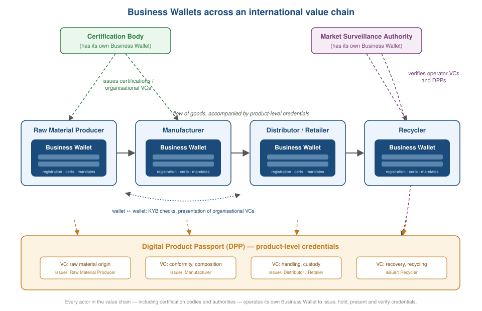

# Introduction
A verifiable credential (VC) is authenticated, tamper-evident, revocable and portable data, issued to a *holder* and verifiable by any third party. Verification is privacy-preserving in that the *verifier* need not contact the issuer, so the issuer does not learn where or with whom the credential was used. These properties suit organisation-related claims: proof of legal registration, authorisations granted to employees or agents, professional certifications, financial-standing attestations, and sanctions or compliance screening results — the material a Business Wallet holds.

This note asks three questions:

- Why hold and present organisational credentials as VCs, rather than as signed documents retrieved over HTTPS?
- Why do Business Wallets fall within the scope of the DPP & Business Wallet Task Force of the W3C Verifiable Credentials Working Group (VCWG)?
- How compatible are existing organisational credential formats with the VC Data Model [[VC-DATA-MODEL-2.0]]?

Three layers are often conflated under the label "Business Wallet standard". Compatibility and interoperability must be assessed separately at each:

- **Organisational credentials**: the data artifacts themselves — proofs of legal registration [[ISO17442]], legal-person attestations [[EIDAS2]], vLEI credentials [[VLEI]], UNTP actor credentials [[UNTP]], mandates, certifications.
- **Wallet capabilities**: what a Business Wallet must be able to do — issue, hold, present and verify credentials, delegate authority, and manage organisational keys.
- **Protocols**: how credentials move between wallets — OpenID4VC, DIDComm, KERI.

# Business Wallets in international value chains
A Business Wallet holds credentials that describe an organisation rather than a product: legal existence, registered address, authorised representatives, licences, certifications, memberships. That organisation may be an economic operator, supplier, certification body, registrar or financial institution. The terms "organisation wallet", "enterprise wallet" and "legal person wallet" (used in the eIDAS2 EU Digital Identity Wallet framework [[EIDAS2]]) are treated here as functionally equivalent.

Every actor in an international value chain needs one, from raw-material producers to certification bodies, logistics providers, retailers and market surveillance authorities, because each must issue, hold and present credentials — including the credentials that make up a DPP.

Unlike a personal wallet, which mainly holds and presents credentials about one natural person, a Business Wallet plays all four roles of the VC ecosystem at once. It **issues** credentials (invoices, declarations of conformity, DPPs, mandates to its own employees), **holds** credentials issued to the organisation, **presents** them to counterparties, and **verifies** credentials presented by others, for example during Know-Your-Business (KYB) checks on a new supplier. This asymmetry drives most requirements specific to Business Wallets.

<figure>
  
  <figcaption>Each economic operator in a value chain holds its own Business Wallet; the wallets interconnect with each other (e.g. for KYB checks) and with product-level credentials such as DPPs.</figcaption>
</figure>

The same reasoning applies to any machine-readable business claim: declarations of conformity, test reports, standards-compliance certificates, purchase orders, invoices. Linking such a document to a verifiable statement about who issued it improves data quality and raises trust across the chain.

# How are Verifiable Credentials used in Business Wallet applications?
The credential subject of an organisational VC is the legal entity itself, identified by a legal entity identifier. Several schemes compete: the Legal Entity Identifier (LEI) [[ISO17442]] maintained by GLEIF, national business registry numbers, D-U-N-S Numbers, and DIDs [[DID-CORE]]. <mark>Open question: which scheme should serve as the canonical credential subject, and how should it be anchored to a resolvable web location or registry entry? May a credential carry several identifiers for the same entity, and if so, which does a verifier trust?</mark>

Implementers first face an architectural choice between two deployment models:

- **Enterprise wallet**: the wallet is a service run by or for the organisation. It operates server-side, driven mostly by software rather than by humans, and employees authenticate *into* it using organisation-internal means. Credentials never leave the organisation's custody.
- **Mandate model**: credentials — or **mandate** (power-of-attorney) credentials deriving authority from them — are issued to the personal wallets of employees or agents, who present them on the organisation's behalf. The mandate states the individual's authority, its scope and its validity period.

Hybrid deployments combine both. The choice determines holder binding, key management, and what must happen when an employee leaves. <mark>Open question: should this note recommend a model per use case (e.g. automated B2B issuance versus in-person representation), or remain model-neutral?</mark>

<figure>
  
  <figcaption>The two deployment models for Business Wallets: enterprise wallet (left) and mandate model (right).</figcaption>
</figure>

A credential held by a Business Wallet can then be made available in three ways:

- the organisation holds the VC in its own enterprise wallet, e.g. a business registration credential received from a registrar;
- a delegated custodian serves a copy: an EUDI Wallet provider [[EUDI-ARF]], a professional services firm, or an industry platform acting as custodian on the organisation's behalf;
- an employee's or agent's personal wallet holds the VC together with a mandate credential.

Holder binding is consequently layered, unlike the classic identity case where a credential binds one natural person to their wallet. The credential subject is a legal person, but every act of holding or presenting is performed by a natural person, or by a machine acting as its agent, whose own authority must be verifiable, time-bounded and revocable. An authorised signatory may leave the company; a mandate may be scoped to a single transaction.

<figure>
  
  <figcaption>Holder binding for a Business Wallet is layered: the credential subject is a legal person, but presentation is performed by a natural person or agent whose authority is itself credentialed.</figcaption>
</figure>

# What is different about a wallet for legal persons?
Assumptions carried over from personal wallets do not hold. The concerns below have no counterpart in the natural-person or product wallet story.

- **Key custody and rotation**: organisational keys outlive any individual employee. Enterprise deployments need HSM-backed custody, role-based keys, multi-party control, and rotation when an authorised signatory changes — without invalidating previously issued credentials.
- **Machine operation**: Business Wallets run largely headless, doing batch issuance of invoices or DPPs and automated presentation in B2B API flows. The personal-wallet consent ceremony, a human tapping "share", does not apply; policy-based automated disclosure replaces it.
- **Multi-user access**: many employees and systems use one wallet concurrently under different permission scopes — who may issue, who may present what, and to whom.
- **Organisational lifecycle**: legal persons merge, split, are renamed and become insolvent. What becomes of credentials issued *by* and *about* the predecessor entity? Products do not merge; companies do.
- **Liability and audit**: if an employee presents a credential under a stale or out-of-scope mandate, who is liable? Corporate contexts also impose audit-logging requirements on wallet operations.

# Why are VCs useful for Business Wallets?
Any digital signature over a business document — a signed PDF, a sealed XML invoice, a certificate served over HTTPS — already provides a baseline:

- **Authenticity**: the signature of the registrar, certification body or notary identifies the actor that made the claim.
- **Integrity**: signature validation reveals any modification made after issuance.
- **Non-repudiation**: the issuer cannot later deny having issued the credential.
- **Issuer identification at rest**: in trade and logistics ecosystems, organisational data is copied and stored locally by many holders, and the hosting system often says nothing about who originally issued it. A signature travels with the data.
- **Integrity over time**: HTTPS protects data only in transit. A signature plus its issuance timestamp supports integrity for as long as the data is retained, and answers questions such as "was this mandate valid at the time of signing?"

VCs add five capabilities that a plain signed document does not have:

- **A standard, machine-readable data model.** [[VC-DATA-MODEL-2.0]] gives issuer, subject, claims, validity period and status a common representation, so a verifier can process a credential from an unfamiliar registry without bespoke parsing. This is the precondition for automated KYB and AML processing.
- **Holder-mediated selective disclosure.** Formats such as SD-JWT VC and BBS+ signatures let an organisation disclose selected claims — its jurisdiction of incorporation but not its registration number — instead of the whole document. Zero-knowledge techniques go further, proving a predicate (turnover above a regulatory threshold, mandate currently valid) without revealing the value. Redacting a signed PDF destroys its signature; redacting a VC need not.
- **Standardised status and revocation.** Registrars, certification bodies and organisations remain responsible for the accuracy of what they issue. VCs carry a machine-checkable status mechanism, so a verifier can learn that an authorisation ended, a mandate expired or a certification lapsed without a bilateral integration with each issuer.
- **Composability and delegation.** A mandate credential can reference the organisational credential it derives authority from, and a Verifiable Presentation can carry both. Chains of authority — parent to subsidiary, organisation to signatory — become verifiable as a unit rather than as unrelated documents.
- **Data sovereignty in a decentralised topology.** Because credentials sit in the organisation's own wallet rather than in a central platform, the organisation decides who sees what. Competitors are kept away from commercially sensitive data while banks, auditors, suppliers and market surveillance authorities see what concerns them. A requestor retrieving a copy from a delegated custodian also avoids signalling its commercial interest to the data owner.

Together these properties raise the trustworthiness of organisational data in KYB, onboarding and market surveillance, and let a relying party — a bank onboarding a client, say — demonstrate afterwards that it acted on authentic, verifiable data. Where business documents are cheap to fabricate, that is a liability argument as much as a security one.

Three topics remain open:

- <mark>**Legal evidence**: do VCs improve on ordinary digitally signed documents for evidentiary purposes, for instance in proving who was authorised to sign a contract at a given time? Does the answer hold in jurisdictions that already recognise eIDAS qualified signatures and seals?</mark>
- **Confidence methods**: the VCWG Confidence Methods task force is defining a mechanism, usable with [[VC-DATA-MODEL-2.0]], that increases a verifier's confidence about a subject identified in a credential. <mark>Does this mechanism apply only within Verifiable Presentations, or also to standalone organisational credentials — and can it express that a natural person is bound to a legal person's mandate?</mark>
- **Real-time updates**: <mark>when an organisation's status changes (a new authorised signatory, a revoked mandate, a renewed certification), can counterparties be pushed updated credentials, or is pull-based status checking the realistic model?</mark>

# Why are VPs useful for Business Wallets?
A Verifiable Presentation (VP) is ephemeral and can carry several VCs at once, retaining the signature of each plus the holder's signature over the package — so a verifier learns both who made each claim and who assembled the set. Alternatively the individual signatures can be dropped, leaving only the presenter's.

Three properties matter in Business Wallet flows:

- **Bundling**: a KYB onboarding submits business registration, good standing and authorised-signatory mandate to a bank as one VP rather than three unrelated files.
- **Proving the issuer too**: the same package can carry credentials showing that the issuer of those claims, a registrar or certification body, is itself recognised and trustworthy.
- **Need-to-know disclosure**: a VP can present only the claims a given counterparty requires, e.g. proof of authorisation without the full organisational chart.

<mark>Open question: what are the arguments against VPs here — dependency on a presentation protocol, verifier-side complexity, or the difficulty of archiving an ephemeral object for later audit?</mark>

# Why is Linked Data useful for Business Wallets?
<mark>Open question: this section needs elaboration and concrete examples. Which vocabularies would a Business Wallet credential reuse — W3C Organization Ontology, schema.org, GLEIF's or UNTP's?</mark>

- Explicit semantic context, and therefore interoperability across business registries and identifier schemes.
- No semantic collisions when data about one entity is combined from national registries, GLEIF, D-U-N-S and others.
- Composability: a mandate credential can link to the organisational credential it derives authority from.
- Better machine and AI exploitation, e.g. automated KYB and AML processing.

# Why is there an international Business Wallet Task Force in the W3C Verifiable Credentials Working Group (VCWG)?
The task force exists because the following problems are shared across jurisdictions and cannot be solved by any single registry or regulation:

- **No common vocabulary** for organisational identity, authorisation and mandate credentials.
- **Too many overlapping standards and registries**: GLEIF vLEI [[VLEI]], national business registries, D-U-N-S, VAT registries, the EBSI Trusted Issuers Registry, eIDAS2 legal-person attestations [[EIDAS2]] — with no shared semantics between them, and hence a need for linked data.
- **Data fusion** across several registries describing the same legal entity.
- **Bootstrapping issuer trust**: how does a verifier know the issuer of a business credential is itself a recognised entity? This depends on the VCWG's recognized-entity work and remains open for the first credential in any chain.
- **Direct dependency with neighbouring task forces**: DPP Vocabularies, VC Recognized Entities, VC Barcodes and Data Integrity. The dependency runs both ways — every economic operator issuing a DPP needs a Business Wallet for its own issuer credentials, and every Business Wallet needs a way to prove its issuer is recognised.

Candidate use cases to define:

- *Single-protocol*: issuing a GLEIF vLEI credential [[VLEI]]; issuing an eIDAS2 legal-person attestation [[EIDAS2]]; issuing a UNTP actor or registration credential [[UNTP]].
- *Multi-protocol*: linking a parent organisation's credentials to those of its subsidiaries across jurisdictions; linking a mandate credential issued under one protocol to an organisational credential issued under another; combining data about one legal entity from several registries and standards.

# Are existing organisational credential formats compatible with VCDM?
There is no single "Business Wallet standard". There are many business-identity and authorisation standards, each addressing a different layer — credential format, wallet capabilities, protocol — as introduced above. Compatibility with [[VC-DATA-MODEL-2.0]] is therefore a per-format question.

The sharpest case is GLEIF's vLEI ecosystem [[VLEI]], built on ACDC (Authentic Chained Data Containers) and KERI rather than on the VCDM. Whether vLEI credentials can be mapped to, or bridged with, VCDM credentials is among the most important open questions in this document.

Work items for this section:

- Assess VCDM applicability to each existing business-identity credential: GLEIF vLEI [[VLEI]], eIDAS2 and EUDI Wallet legal-person attestations [[EUDI-ARF]], UNTP actor credentials [[UNTP]], national registries.
- Settle which identifier scheme serves as the canonical credential subject.
- Produce guidance for creating VCDM-based Business Wallet credentials.
- Consider a test suite for VCDM-based Business Wallet credentials.
- Consider a Business-Wallet playground environment.
- Build a reference implementation mapping an existing standard, e.g. GLEIF vLEI, onto VCDM.

# Glossary
<mark>All definitions are placeholders pending review; terms should eventually align with [[VC-DATA-MODEL-2.0]] and the eIDAS2 [[EIDAS2]] vocabulary.</mark>

- **Business Wallet**: a wallet operated by or on behalf of a legal person, able to issue, hold, present and verify verifiable credentials.
- **Legal person**: an organisation with legal personality — a company, authority or association — that can hold rights and obligations.
- **Natural person**: a human individual.
- **Mandate**: a credential stating that a natural person or system is authorised to act on behalf of a legal person, with a defined scope and validity period.
- **LPID**: Legal Person Identification Data, the eIDAS2 [[EIDAS2]] attestation identifying a legal person.
- **vLEI**: verifiable Legal Entity Identifier, GLEIF's credentialised form of the LEI [[VLEI]].
- **KYB**: Know Your Business, the verification of a counterparty organisation's identity, standing and authorised representatives.
- **Holder binding**: the mechanism binding a credential to the wallet or entity presenting it.
